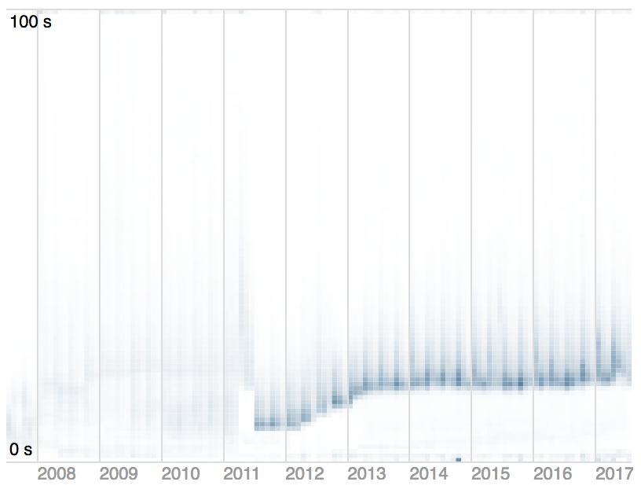

# D3 Latency Heatmap

This is a reusable D3 latency heatmap chart, which is a highly
effective way to visualize latency data over time.  The chart is
fast, easy to use, and produces beautiful images such as the
below:



For more on latency heatmaps, see:
* [Brendan Gregg's Latency Heat Maps](http://www.brendangregg.com/HeatMaps/latency.html)
* My blog post series on [Visualizing Latency](https://stevenengelhardt.com/post-series/visualizing-latency-2017/)
* [Visualizing System Latency](https://queue.acm.org/detail.cfm?id=1809426)

## Installing

If you use NPM, `npm install d3-latency-heatmap`.  Otherwise, download
the [latest release binaries](https://sengelha.github.io/d3-latency-heatmap/d3-latencyHeatmap.v1.zip)
or the [latest release source code](https://github.com/sengelha/d3-latency-heatmap/releases/latest).
You can also load directly from
[unpkg.com](https://unpkg.com/d3-latency-heatmap/).

For convenience, you can use the [latest release
binaries](https://sengelha.github.io/d3-latency-heatmap/d3-latencyHeatmap.v1.zip)
with D3 version 4.x as follows (D3 version 3.x is not supported):

```html
<script src="//d3js.org/d3.v4.min.js"></script>
<script src="//sengelha.github.io/d3-latency-heatmap/d3-latencyHeatmap.v1.min.js"></script>

<div id="chart"></div>
<script>
(function() {
    var parseTime = d3.timeParse("%Y-%m");
    var chart = d3.latencyHeatmap()
        .x(function (d) { return parseTime(d.date); })
        .y(function (d) { return +d.bucket; })
        .yFormat(function(d) { return d + " s"; })
        .count(function(d) { return +d.count; })
        .colorRange([d3.rgb('#FFFFFF'), d3.rgb('#5B82A1')])
        .tooltipText(function (d) { return "YearMonth: " + d[0].toISOString().substring(0, 7) + "\nBucket: " + d[1] + "\nCount: " + d[2]; })
        .rectSize([8, 8]);
    d3.csv("//sengelha.github.io/d3-latency-heatmap/sample-data.csv", function (data) {
        var svg = d3.select("#chart")
            .datum(data)
            .call(chart);
    });
})();
</script>
```

## Usage Notes

* In order to use this chart, your data must already be bucketized
  -- you cannot use raw events.  A bucket contains three data points:
  the x-value, the y-value, and the number of observations in this
  bucket.
* The color intensity of a cell is determined based on its value
  relative to the maximum value of all buckets.  This implies that
  if the number of observations per x-value (e.g. per day) increases
  over time, the cells will start with faint colors and grow more
  intense over time.
* This chart's API was modelled upon Mike Bostock's
  [Toward Reusable Charts](https://bost.ocks.org/mike/chart/) proposal.

## Examples

* [Report Queue Latency](samples/report-queue-latency.html)
* [Animated Heatmap](samples/animated-heatmap.html)
* [Using with Unpkg](samples/unpkg-modules.html)

## API Reference

### d3.latencyHeatmap()

Creates a new latency heatmap chart which may later be rendered into a
container.  Returns a *latencyHeatmap* object.

The typical pattern that the chart is rendered is by:
1. Selecting the container (e.g. a `div`) into which the chart will be rendered
2. Assigning the data to the container
3. Using d3's `call()` method.

Example:
```javascript
var data = [...]; // May be sourced using d3.csv(), d3.json(), etc.
d3.select("#container")
    .datum(data)
    .call(chart);
```

### *latencyHeatmap*.colorRange(*[minColor, maxColor]*)

Defines the color range to be used when filling cells.  This color
range will be interpolated using `d3.interpolateRgb()`.  If not set,
defaults to `[d3.rgb('#FFFFFF'), d3.rgb('#F03524')]`.

Example:
```javascript
d3.latencyHeatmap()
    .colorRange([d3.rgb('#FFFFFF'), d3.rgb('#5B82A1')]);
```

### *latencyHeatmap*.count(*accessor*)

Defines an count accessor which is called for each row in `data`.
Must return a number, which corresponds to the number of observations
within the bucket.  If not set, defaults to `function(d) { return d[2]; }`.

Example:
```javascript
d3.latencyHeatmap()
    .count(function(d) { return d.count; }); // d is { x: Date, y: number, count: number }
```

### *latencyHeatmap*.height(*h*)

Sets the height of the rendered chart to *h*.  Automatically scales
the size of the drawn rectangles to fit the specified chart height.
If not set, defaults to 400.

This value is ignored if the rectangle size is set using
**rectSize**().

Example:
```javascript
d3.latencyHeatmap()
    .height(400);
```

### *latencyHeatmap*.rectSize(*[w, h]*)

Sets the size of the individual rectangles used to draw the chart to
be width *w* and height *w*.  When set, the chart automatically
calculates the total width and height based on the number of elements
to be drawn.

Example:
```javascript
d3.latencyHeatmap()
    .rectSize([6, 4]);
```

### *latencyHeatmap*.tooltipText(*formatter*)

Defines an accessor which can be used to control how tooltips for
each drawn rectangle are formatted.  *formatter* is called with an
array with three elements: the x-value for the tick (a `Date` object),
the y-value for the tick (a number) and the count.  If not set, no
tooltips are drawn.

Example:
```javascript
d3.latencyHeatmap()
    .tooltipText(function (d) { return "X: " + d[0] + " Y: " + d[1] + " Count: " + d[2]; });
```

### *latencyHeatmap*.width(*w*)

Sets the width of the rendered chart to *w*.  Automatically scales
the size of the drawn rectangles to fit the specified chart width.
If not set, defaults to 600.

This value is ignored if the rectangle size is set using
**rectSize**().

Example:
```javascript
d3.latencyHeatmap()
    .width(600);
```

### *latencyHeatmap*.x(*accessor*)

Defines an x accessor which is called for each row in `data`.  Must return
a `Date` object, which must correspond to the timestmap of the bucket.
If not set, defaults to `function(d) { return d[0]; }`.

Example:
```javascript
d3.latencyHeatmap()
    .x(function(d) { return d.x; }); // d is { x: Date, y: number, count: number }
```

### *latencyHeatmap*.xFormat(*formatter*)

Defines an accessor which can be used to control how tick labels on the
x-axis are formatted.  *formatter* is called with the x-value for the tick,
which is a `Date` object.  If not set, defaults to the d3 default time
axis tick formatter.

Example:
```javascript
d3.latencyHeatmap()
    .xFormat(function(dt) { return dt.toLocaleString(); });
```

### *latencyHeatmap*.y(*accessor*)

Defines an y accessor which is called for each row in `data`.  Must return
a number, which corresponds to the y-value of the bucket.
If not set, defaults to `function(d) { return d[1]; }`.

Example:
```javascript
d3.latencyHeatmap()
    .y(function(d) { return d.y; }); // d is { x: Date, y: number, count: number }
```

### *latencyHeatmap*.yFormat(*accessor*)

Defines an accessor which can be used to control how tick labels on the
y-axis are formatted.  *formatter* is called with the y-value for the tick.
If not set, defaults to the d3 default linear axis tick formatter.

Example:
```javascript
d3.latencyHeatmap()
    .yFormat(function(y) { return y + " ms"; }); // y values are denoted in ms
```

## License

This project is licensed under the MIT License.
