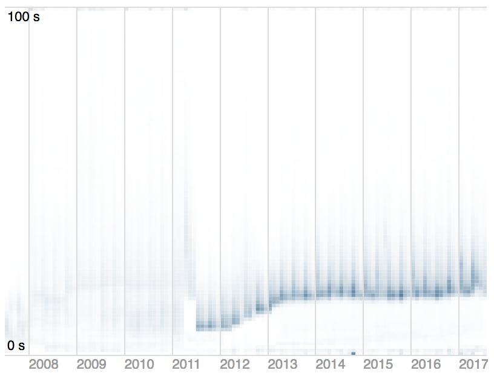

# D3 Latency Heatmap

This project provides a reusable D3 latency heatmap chart, which is
an effective way to visualize latency data.  This chart is quick and
easy to use, and produces beautiful images such as the below:



For more on latency heatmaps, see:
* [Brendan Gregg's Latency Heat Maps](http://www.brendangregg.com/HeatMaps/latency.html)
* [Visualizing System Latency](https://queue.acm.org/detail.cfm?id=1809426)

## Getting Started

D3 version 3.x is required (4.x is not yet supported).

```html
<script src="//d3js.org/d3.v3.min.js"></script>
<script src="//cdn.rawgit.com/sengelha/d3-latency-heatmap/master/latency-heatmap.v3.js"></script>

<div id="chart"></div>
<script>
(function() {
    var formatTime = d3.time.format("%Y-%m");
    var chart = d3.latencyHeatmap()
        .x(function (d) { return formatTime.parse(d.date); })
        .y(function (d) { return +d.bucket; })
        .yFormat(function(d) { return d + " s"; })
        .count(function(d) { return +d.count; })
        .colorRange([d3.rgb('#FFFFFF'), d3.rgb('#5B82A1')])
        .width(400)
        .height(300);
    d3.csv("//cdn.rawgit.com/sengelha/d3-latency-heatmap/master/samples/example1.csv", function (data) {
        var svg = d3.select("#chart")
            .datum(data)
            .call(chart);
    });
})();
</script>
```

## API Reference
